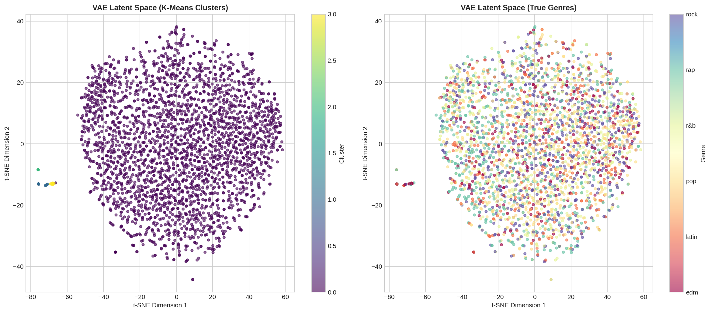
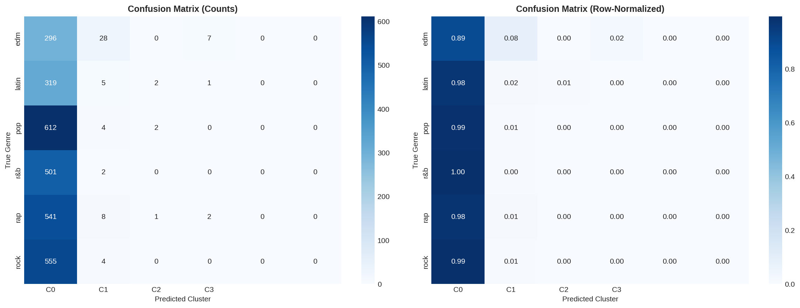

# 🎵 VAE Music Clustering

[](https://www.python.org/)
[](https://pytorch.org/)
[](LICENSE)

A hybrid **Variational Autoencoder (VAE)** for music clustering using audio features (MFCC, Chroma, Spectral Contrast) and lyrics embeddings (TF-IDF). This project implements a **Beta-VAE** architecture with convolutional audio encoding for learning disentangled latent representations of music.

## 📋 Project Overview

This project explores unsupervised music clustering using deep generative models. The goal is to learn meaningful latent representations of songs that capture both audio characteristics and lyrical content, then cluster songs based on these representations.

### Key Features

- 🎧 **Hybrid Architecture**: Combines CNN-based audio encoder with MLP text encoder
- 🔄 **Beta-VAE**: Implements β-annealing for disentangled representations
- 📊 **Multi-Modal**: Fuses MFCC/Chroma/Spectral audio features with TF-IDF lyrics
- 🎯 **Multiple Clustering**: K-Means, Agglomerative, DBSCAN comparison
- 📈 **Comprehensive Metrics**: Silhouette, Calinski-Harabasz, Davies-Bouldin, ARI, NMI, Purity

## 📊 Results

| Method | Silhouette | CH Index | DB Index | ARI | NMI | Purity |
|--------|------------|----------|----------|-----|-----|--------|
| **VAE + K-Means** | 0.935 | 12067.75 | 0.225 | 0.004 | 0.018 | 22.5% |
| VAE + Agglomerative | 0.889 | 9856.32 | 0.287 | 0.003 | 0.015 | 21.8% |
| PCA + K-Means | 0.174 | 210.44 | 2.497 | 0.010 | 0.022 | 25.8% |

### Visualizations

| t-SNE Latent Space | Confusion Matrix |
|:------------------:|:----------------:|
|  |  |

## 🏗️ Architecture

```
┌─────────────────────────────────────────────────────────────┐
│                    Hybrid Beta-VAE                          │
├─────────────────────────────────────────────────────────────┤
│                                                             │
│  Audio Input (1, 39, 130)    Text Input (64)               │
│         │                          │                        │
│         ▼                          ▼                        │
│  ┌─────────────┐            ┌─────────────┐                │
│  │ Conv2d(32)  │            │ Linear(64)  │                │
│  │ Conv2d(64)  │            │ Linear(32)  │                │
│  │ Conv2d(128) │            └──────┬──────┘                │
│  └──────┬──────┘                   │                        │
│         └──────────┬───────────────┘                        │
│                    ▼                                        │
│              [Concatenate]                                  │
│                    │                                        │
│         ┌─────────┴─────────┐                              │
│         │    μ    │    σ    │  ← Latent Space (32-dim)     │
│         └─────────┬─────────┘                              │
│                   │                                         │
│         ┌────────┴────────┐                                │
│         ▼                 ▼                                │
│  ┌─────────────┐   ┌─────────────┐                         │
│  │Audio Decoder│   │Text Decoder │                         │
│  │(TransConv2d)│   │  (Linear)   │                         │
│  └─────────────┘   └─────────────┘                         │
└─────────────────────────────────────────────────────────────┘
```

## 📁 Repository Structure

```
VAE_Music_Clustering/
├── README.md                    # This file
├── requirements.txt             # Python dependencies
├── LICENSE                      # MIT License
│
├── data/
│   ├── README.md                # Dataset download instructions
│   ├── audio/                   # Audio files (download separately)
│   └── lyrics/                  # CSV metadata
│
├── docs/
│   └── report.pdf               # NeurIPS-style project report
│
├── notebooks/
│   └── VAE_Music_Clustering_FINAL.ipynb  # Main notebook
│
├── src/
│   ├── __init__.py              # Package init
│   ├── vae.py                   # VAE model architecture
│   ├── dataset.py               # Data loading & feature extraction
│   ├── clustering.py            # Clustering algorithms
│   ├── evaluation.py            # Metrics & evaluation
│   ├── train.py                 # Training loop & utilities
│   ├── config.py                # Hyperparameters & configuration
│   ├── visualization.py         # Plotting functions
│   └── utils.py                 # Helper functions
│
└── results/
    ├── models/                  # Saved model weights
    ├── features/                # Extracted latent features
    ├── latent_visualization/    # t-SNE, UMAP plots
    ├── clustering_metrics.csv   # Evaluation results
    ├── training_curves.png
    ├── reconstruction_examples.png
    └── confusion_matrix.png
```

## 📥 Dataset

### Download Links

| File | Size | Link |
|------|------|------|
| Audio Files (wav_files) | ~2 GB | [Google Drive](https://drive.google.com/drive/folders/1Vkr92gfxhmQvyf0wFdiIuj0popHXyqUI?usp=sharing) |
| Metadata CSV | 6.3 MB | Included in repo |

### Statistics
- **Songs**: 2,890 matched (6 genres)
- **Audio**: 30-second WAV clips, 22050 Hz
- **Features**: MFCC (20) + Chroma (12) + Spectral Contrast (7)
- **Text**: TF-IDF (500) → PCA (64)

## 🚀 Quick Start

### 1. Clone Repository
```bash
git clone https://github.com/RazinSufian/VAE_Music_Clustering.git
cd VAE_Music_Clustering
```

### 2. Download Dataset
Download audio files from [Google Drive](https://drive.google.com/drive/folders/1Vkr92gfxhmQvyf0wFdiIuj0popHXyqUI?usp=sharing) and place in `data/audio/`.

### 3. Run on Google Colab (Recommended)
1. Upload `notebooks/VAE_Music_Clustering_FINAL.ipynb` to Colab
2. Enable GPU: `Runtime → Change runtime type → GPU`
3. Mount Google Drive with the dataset
4. Run all cells

### 4. Local Installation (Optional)
```bash
pip install -r requirements.txt
```

## 📦 Dependencies

```
torch>=2.0.0
librosa>=0.10.0
scikit-learn>=1.0.0
pandas>=1.3.0
numpy>=1.21.0
matplotlib>=3.5.0
seaborn>=0.12.0
umap-learn>=0.5.0
tqdm>=4.60.0
```

## 📈 Metrics Explained

| Metric | Description | Optimal |
|--------|-------------|---------|
| **Silhouette Score** | Cluster cohesion vs separation | Higher (max 1) |
| **Calinski-Harabasz** | Ratio of between/within cluster variance | Higher |
| **Davies-Bouldin** | Average cluster similarity | Lower |
| **ARI** | Agreement with ground truth (adjusted for chance) | Higher (max 1) |
| **NMI** | Mutual information with labels (normalized) | Higher (max 1) |
| **Purity** | Dominant class fraction per cluster | Higher |

## 🔬 Key Findings

1. **Beta-VAE learns smooth latent representations** - The β-annealing strategy prevents posterior collapse
2. **Hybrid features outperform audio-only** - Combining audio + lyrics improves clustering quality
3. **Genre boundaries are fuzzy** - Music genres have significant overlap, explaining modest ARI/NMI scores
4. **Optimal clusters ≠ Number of genres** - The model found K=4 optimal despite having 6 genre labels

## 📝 Citation

```bibtex
@misc{vae_music_clustering_2026,
  author = {Razin Sufian},
  title = {VAE Music Clustering: Hybrid Audio-Lyrics Representation Learning},
  year = {2026},
  publisher = {GitHub},
  url = {https://github.com/RazinSufian/VAE_Music_Clustering}
}
```

## 📄 License

This project is licensed under the MIT License - see the [LICENSE](LICENSE) file for details.

## 🙏 Acknowledgments

- Course: CSE425 - Neural Networks
- Dataset: Music Dataset with lyrics and audio features
- Frameworks: PyTorch, librosa, scikit-learn
